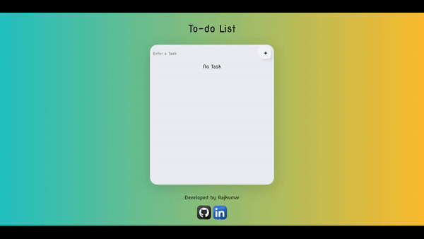

# Vue.js Simple To-Do List

This is a simple to-do list application built using Vue.js, with features such as adding, deleting, and completing tasks. The application also utilizes local storage to persist tasks even after page reload. Additionally, there is an option to clear all tasks from the local storage.

## Features

- Add tasks: Enter a task in the input field and click "Add Button" to add it to the to-do list.
- Delete tasks: Each task has a "Remove" button that allows you to delete the corresponding task from the list.
- Complete tasks: Tasks can be marked as completed by clicking the "Complete" button next to each task.
- Task Validation: The application includes validation to ensure that an empty task cannot be added.
- Local Storage: All tasks are stored in the local storage, ensuring persistence even after page reload.
- Clear All Tasks: You can clear all tasks from the local storage by clicking the "Clear All Tasks" button.

## Getting Started

To run the application, follow these steps:

1. Clone the repository or download the source code.
2. Open the `index.html` file in a web browser.
3. Start adding, deleting, and completing tasks.

## Technologies Used

The application is built using the following technologies:

- Vue.js: The JavaScript framework used for creating reactive and interactive user interfaces.
- CDN Links: The application utilizes Vue.js and other required libraries via CDN links, allowing you to quickly run the application without any local setup.

## File Structure

The main files of the application are structured as follows:

- `index.html`: The HTML file that contains the application's structure and templates.
- `main.js`: The JavaScript file that defines the Vue.js application logic, including task manipulation and local storage handling.

## Contributing

Contributions are welcome! If you find any issues or want to enhance the application, feel free to create a pull request or raise an issue in the repository.

## Acknowledgments

- The application is built using Vue.js, a powerful JavaScript framework for building user interfaces.
- The use of local storage ensures that tasks are persisted across page reloads.
- Special thanks to the Vue.js community for their valuable contributions and support.

---

Feel free to customize and enhance the application further based on your requirements. Happy task managing with the Vue.js Simple To-Do List!